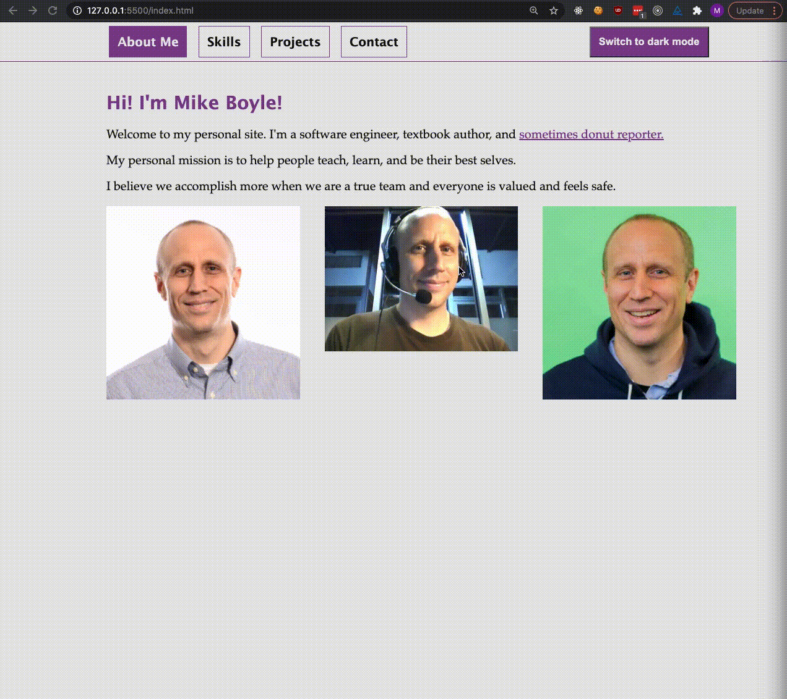

# Personal Web Site

## Introduction

This project will build on the technical and non-technical skills that you have learned up to now:

- Building Web sites with HTML and CSS
- Using JavaScript to make Web sites interactive
- Fundamental UI/UX principles
- Developing your personal brand and online profiles

You'll use these skills to build an MVP of your **personal web site**. This Web site is a place to show the tech industry who you are and what you can do.

By the time you are job ready, your personal site will probably use additional technologies and skills we have not covered yet. For now, this project will be an MVP (Minimum Viable Product) that you can continue to enhance during the course.

## Examples

This sample project is far from perfect. You do not need to copy any specific feature here. You can and should use your own creativity!

For more inspiration, here are some personal sites from alums!

- [Carlos Martinez (he/him)](https://carlosmartinez.dev/)
- [Uduakabasi Abasiurua (she/her)](www.uduakabasiabasiurua.com)
- [Isaiah Collazo (he/him)](www.isaiahcollazo.com)
- [Peter Fiorentino (he/him)](www.peter-fiorentino.com)
- [Suzette Islam (she/her)](www.suzetteislam.com)
- [Owen Jones (he/him)](https://ojonesdev.netlify.app/)
- [Maria Martinez (she/her)](http://www.marializamartinez.com/)
- More sites from the Pursuit Community [here](https://gist.github.com/alejo4373/b2d899ecf45fadb564f24a84b9f59a4a)

## Setup Instructions

1. Fork this repo
1. Clone the forked repo to your machine
1. `cd` to the cloned folder and write your code!

## Submission Instructions

1. Complete the project
1. Commit and push your changes to your fork
1. Submit a pull request back to the assignment repo
1. Paste a link to your pull request (not your fork!) on Canvas and submit
1. You only need to submit for the assignment that says `Acceptance Criteria`

> _Note_: Remember to `git add`, `git commit` and `git push` regularly

## Trello Board

For this project, we will give you a blank Trello board and you will be responsible for creating cards this time.

Start by copying [this starter Trello board](https://trello.com/b/tTFpk77m/fsw-personal-site-project).

- Instructions here: [How to copy a Trello board](https://help.trello.com/article/802-copying-cards-lists-or-boards#:~:text=Open%20the%20board's%20menu%2C%20then,it%20to%20your%20new%20board.)
- Give your board a title with your name and class number (7.2, 8.3, etc...)

For past projects, we gave you a board that already had cards on it. This time, you will create the cards.

- Create a card for each user story and put it in the `To Do` column.
- In each card, create a checklist with the acceptance criteria for the story.

You may also want to create cards for other project milestones and criteria. For example:

- Create design mockup
- Do user testing
- Create grid layout
- Create navigation UI
- Choose accessible fonts and colors
- Prepare demo for Feedback Fair
- Make UI work for mobile devices
- Deploy site to GitHub pages in class

Also notice that you can set **DEADLINES** for a card, which may help you manage your time.

When you are done, replace the link below with the link to your Trello board:

[Replace this link with the link to your board](https://trello.com/b/tTFpk77m/fsw-personal-site-project)

## User Stories

### As a user, I can learn information about you.

#### Acceptance criteria

- I can see your full name.
- I can see your Pursuit headshot photo.
- I can read a short description of you.

### As a user, I can learn about your recent projects.

#### Acceptance criteria

- I can learn about at least two projects that you built.
- For each project, I can see a screenshot of the project, a text description of the project, and a link to the project's GitHub repo.

### As a user, I can see how to contact or follow you.

#### Acceptance criteria

- I can click a link to send a message to your Pursuit email address.
- I can click a link to visit your GitHub page.
- I can click a link to visit your LinkedIn page.

### As a user, I can navigate your site.

#### Acceptance criteria

- There is a navigation UI that has links to all of the pages or sections.
- When I click on a link in the navigation UI, I can view that page/section.

### As a user, I can experience an interactive UI.

#### Acceptance criteria

- I can change the content or appearance of the site when I click or interact with elements on the page.
- Errors do not appear in the browser console when I use an interactive element.

## Code Quality Rubric

All scored from 0-2 (Not Demonstrated, Developing, Mastered)

- M2.1: Use HTML to build websites
- M2.3: Use CSS selectors to specify display based on an element's characteristics
- M2.5: Manipulate the DOM using JavaScript
- M2.6: Manipulate content and styling on the page by utilizing DOM Events and Event Listeners
- M2.7: Use Flexbox and Grid to layout a page

## NEW - UI/UX Rubric

All scored from 0-1 (Not Demonstrated, Demonstrated)

- Your project uses grids to organize information clearly.
- Your project has a clear and consistent structure on each section or page.
- Your project is readable on mobile devices.
- Your project uses accessible color contrast
- Your project follows font-size best practices
- Your project is limited to 3-4 font variations.
- Your project has navigation that appears in a consistent place across pages and is easy to use

## Making your site interactive

Use your JavaScript and DOM skills to make your site interactive. In other words, there should be at least one place where clicking, selecting, hovering, or submitting information changes the content of the page.

Here are a few ideas to consider trying:

- Clicking on a button expands to show more details or text.
- Clicking on a button sorts a list of things (ascending or descending).
- Clicking on a button or selecting an option filters a list of things (example: show all photos, show only travel photos)
- Instead of navigating to different pages, show and hide page content using JavaScript without loading a new page.
- Entering information in a form adds content to the page or changes the page content
- Your own creative idea!

  
Hints for showing and hiding elements

  
  **CSS based approach**
  - What CSS attribute can we use to make an element hidden?
  - Can we give an HTML element a CSS class that is styled to make itself hidden?
  - Can we create an extra class that would make the same element visible?
  - How can we use DOM events and JavaScript to add and remove classes from elements?

**JS based approach**

- Can we store information that we want to show or hide in our JavaScript file instead of in HTML?
- How can we use JavaScript to keep track of what things are supposed to be shown or hidden?
- How can we use DOM events and JavaScript to change or replace the HTML or text content of an element when we want to show or hide something?

## Pages or sections

You can choose to make your site one long page broken up into sections, or your site can have a few different pages.

Your site needs to implement all user stories and meet the UI/UX criteria. There are many ways to structure your site to do this. Personal sites often have some or all of these pages:

1. **Landing/Home Page**:
   Your homepage is the first page that appears when the site loads. You know what a homepage is. You can put whatever you want here!

2. **About/Intro**:
   The about page is where you get to talk about yourself. Do you have a pop pitch? This is the place to put it. Write a bio. Show a picture. Talk about your love of cats, books, or milkshakes. Make this part personal. You can have combine this section wit your landing page if it makes sense.

3. **Projects**:
   This section is where you put projects you've worked on during your time at Pursuit and personal projects you may have. Link to each project's GitHub repo, include a screenshot, and write a description. If the project is deployed, include a link to the live version.

4. **Contact links**:
   You can put it at the bottom of your page as a footer or in a contact me section. A good font with tons of social icons is [FontAwesome](https://fontawesome.com/)

5. **Other**: (Optional) Anything else with things you may want to include, if you write, then a blog section, if you paint or photograph then a gallery section etc.
